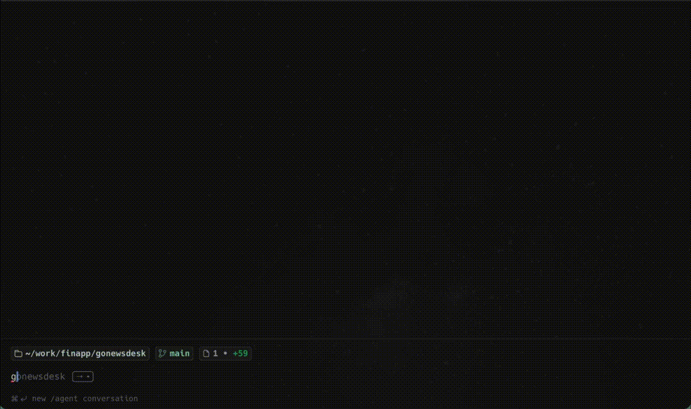

# News desk for traders

GoNewsDesk is a terminal news desk for traders. It merges real-time market news from multiple providers, applies headline filters, and displays the result in an interactive TUI.



## Features

- Merge multiple news streams into one feed
- Filter headlines with include/exclude keyword lists
- Highlight important headlines using keyword matches
- Open a detailed modal view for each news item

## News sources

### Stocklabs

[Stocklabs](https://stocklabs.com/) provides a stream of market-related posts (primarily from X-focused news profiles). In GoNewsDesk, this source can be enabled independently and optionally backfilled with recent historical items at startup.

- Config key: `stocklabs.enabled`
- Historical backfill key: `stocklabs.includeHistorical`

If the `includeHistorical` is `false`, only the news will appear that are published after the app starts. If it's `true`, the app will fetch the latest news articles from Stocklabs and publish them to the merged feed oldest-first.

However you don't need to use this app to see the news from Stocklabs, you can just visit their news page https://stocklabs.com/news and see the news there.

### Alpaca

[Alpaca](https://alpaca.markets/) provides a real-time news WebSocket feed from Benzinga. You need to have an Alpaca account to get the API keys. However the account doesn't have to be live, simply registering and creating a paper account is enough, don't even have to go through the KYC process. Although, even if you have a live account, it's recommended to use a paper account credentials for the least privilege principle.

This source is optional and only starts when all of the following are true:

- `alpaca.enabled` is `true`
- `alpaca.apiKeyID` is set
- `alpaca.apiKeySecret` is set

Optional startup backfill:

- Historical backfill key: `alpaca.includeHistorical`

If the `includeHistorical` is `false`, only the news will appear that are published after the app starts. If it's `true`, the app will fetch the latest 20 news articles from Alpaca and publish them to the merged feed oldest-first.

## Filters

Filters are applied to the merged stream, regardless of source.

- `excludeKeywords`: if any keyword matches the headline, the item is dropped.
- `includeKeywords`: if this list is non-empty, at least one keyword must match.
- `highlightKeywords`: if any keyword matches, the news tile is highlighted in the UI.

Matching is case-insensitive and based on substring checks.

## UI options

- `ui.shortHeadlineOnly`: when `true`, tiles show only meta and a one-line headline (no body).
- `ui.truncateTileBody`: when `true`, tile body text in the main list is shortened.
- `ui.tileBodyMaxChars`: max tile body length before truncation (default: `300`).

The full, original headline/body is still used by details and highlight matching.

## Controls

- `F1`: open/close the logs panel
- `q`: quit the application
- `Enter`: open the selected news details modal (and close it when modal is focused)
- `Esc`: close modal/logs panel
- `Arrow Up` / `Arrow Down`: move selection
- `Page Up` / `Page Down`: scroll by one page
- `Home`: jump to the first item
- `End`: jump to the latest item

## Configuration

By default, the app reads configuration from `config.yaml` in the current directory.

You can override the config path with:

- `--config <path>`
- `CONFIG=<path>` environment variable

An example configuration is available in `config.example.yaml`.

## Installation

### Install with Go CLI

This installs `gonewsdesk` to your Go bin directory (usually `~/go/bin`), so you can run it like a normal command.

```bash
go install github.com/barandras/gonewsdesk@latest
```

Then run:

```bash
gonewsdesk
```

### Install from release binaries

Prebuilt binaries are published in [GitHub Releases](https://github.com/barandras/gonewsdesk/releases).

Pick a version and architecture (`amd64` or `arm64`), then use one of the following.

Architecture quick guide:

- `amd64`: most Intel/AMD CPUs
- `arm64`: Apple Silicon Macs (M1/M2/M3/M4) and ARM Linux devices

#### macOS

```bash
VERSION=v0.1.0
ARCH=arm64
curl -fLO "https://github.com/barandras/gonewsdesk/releases/download/${VERSION}/gonewsdesk_${VERSION#v}_darwin_${ARCH}.tar.gz"
tar -xzf "gonewsdesk_${VERSION#v}_darwin_${ARCH}.tar.gz"
chmod +x gonewsdesk
sudo mv gonewsdesk /usr/local/bin/gonewsdesk
gonewsdesk
```

#### Linux

```bash
VERSION=v0.1.0
ARCH=amd64
curl -fLO "https://github.com/barandras/gonewsdesk/releases/download/${VERSION}/gonewsdesk_${VERSION#v}_linux_${ARCH}.tar.gz"
tar -xzf "gonewsdesk_${VERSION#v}_linux_${ARCH}.tar.gz"
chmod +x gonewsdesk
sudo mv gonewsdesk /usr/local/bin/gonewsdesk
gonewsdesk
```

#### Windows (PowerShell)

```powershell
$Version = "v0.1.0"
$Arch = "amd64"
$Asset = "gonewsdesk_$($Version.TrimStart('v'))_windows_$Arch.zip"
Invoke-WebRequest -Uri "https://github.com/barandras/gonewsdesk/releases/download/$Version/$Asset" -OutFile $Asset
Expand-Archive -Path $Asset -DestinationPath .
.\gonewsdesk.exe
```

### Configuration file requirement

`gonewsdesk` needs a config file before it can start.

Choose one of these options:

1. Easiest: copy `config.example.yaml` to `config.yaml` in the same folder where you run `gonewsdesk`.
2. Keep a custom filename/location and pass it explicitly with `--config <path>`.
3. Set `CONFIG=<path>` as an environment variable (useful in scripts).

Examples:

```bash
cp config.example.yaml config.yaml
gonewsdesk
```

```bash
gonewsdesk --config ./config.local.yaml
```

```bash
CONFIG=./config.local.yaml gonewsdesk
```

## Release binaries

Each release includes a `checksums.txt` file.

### Verify checksums

```bash
shasum -a 256 -c checksums.txt
```

Windows (PowerShell):

```powershell
Get-FileHash .\gonewsdesk_<version>_windows_amd64.zip -Algorithm SHA256
```

Then compare the reported hash to the matching entry in `checksums.txt`.

## Releasing a new version

Releases are created by pushing a semantic version tag (`vX.Y.Z`). The release workflow then builds and publishes binaries to GitHub Releases automatically.

1. Make sure your changes are merged to `main`.
2. Pull latest `main` locally:

```bash
git checkout main
git pull origin main
```

3. Create a new version tag:

```bash
git tag v0.1.0
```

4. Push the tag:

```bash
git push origin v0.1.0
```

5. Confirm the `Release` GitHub Action succeeds and assets appear in [GitHub Releases](https://github.com/barandras/gonewsdesk/releases).
